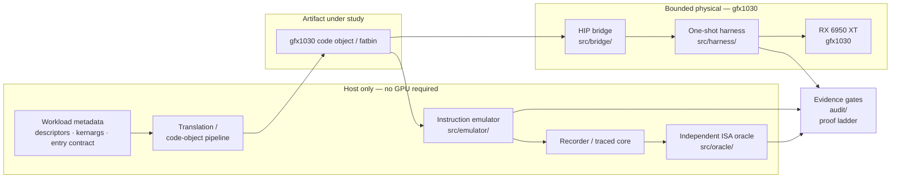

# Architecture

Summary view. The detailed component design is in
[docs/architecture.md](docs/architecture.md).

## Data path

## The two branches are not interchangeable

The host branch is fast, deterministic, and reproducible on any machine.
The physical branch is authoritative but scarce: each run costs a bounded
one-shot experiment and can reset the GPU engine.

The evidence gates exist to stop a result from being promoted above the
rung it actually reached. **Host agreement is never evidence of physical
liveness**, and physical liveness on one workgroup is never evidence that
a complete job will run.

## Components

### `src/emulator/` — host instruction emulator

An original wave32 gfx1030/gfx1100 instruction emulator with EXEC/VCC/SCC
semantics, deterministic execution, and cycle detection on full state. It
models the LDS/DS (data-share) address arithmetic at exact operand width,
including per-form immediate semantics and out-of-bounds behaviour.

Its hardest correctness surface is wave32 control flow: EXEC-mask
interaction with branches, VCC/SCC updates, and the difference between an
instruction that is skipped and one that is flagged-but-still-executed.
Those two are not the same, and conflating them produces emulators that
look correct and are not.

### `src/oracle/` — independent scalar ISA oracle

A separately written scalar reference used to cross-check the emulator.
**Independence is the entire point.** An oracle that imports and restates
the emulator's own arithmetic validates nothing: it will agree with the
emulator on every input, including the wrong ones. The oracle is therefore
written against the ISA definition, not against the emulator's code.

### `src/isa/` — decode, rebuild, and memory-model gates

Instruction decoding, machine-code bitmap handling, program rebuilding,
and a global-out-of-bounds hard gate. The gate exists because an
out-of-bounds global access in the model previously returned plausible
data instead of failing loudly — a defect that produces wrong numbers
rather than errors.

### `src/bridge/` — HIP interop

An original ABI-forwarding bridge exposing exactly the HIP entry points
the upstream runtime imports, each forwarded to the versioned HIP runtime
that actually enumerates gfx1030 on this platform. Design properties:

- **fail-closed backend load** — a missing backend export produces a
  documented error, never a silent success;
- **fatbin identity gate** — registration is gated on a content hash, so
  the wrong code object cannot be substituted silently;
- **mock backend** — a deterministic stand-in exporting the same symbol
  set, which lets the entire launch path be exercised with no GPU and no
  real runtime present.

### `src/harness/` — bounded physical harnesses

Small host programs that run exactly one experiment. They preflight first,
never retry automatically, and preserve raw output.

### `tools/` — host-side analysis utilities

Census, differential, determinism, throughput, and artifact-identity
utilities used to characterise results on the host.

## Dependencies

The Python modules form one flat import namespace; `conftest.py` puts every
`src/*` directory on `sys.path`. The C++ components need MSVC v143 + the
Windows SDK, and the HIP path needs an AMD ROCm install. Nothing
third-party is vendored — see [THIRD_PARTY_NOTICES.md](THIRD_PARTY_NOTICES.md).
