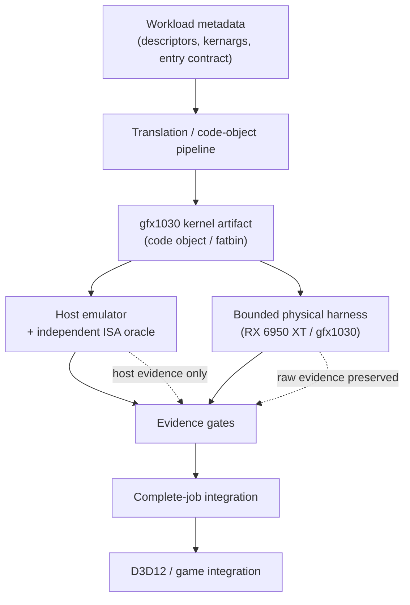

# DLSS Neural Rendering on AMD RDNA2 (gfx1030)

### Experimental Compatibility Research

[](https://github.com/Sakushey/gfx1030-dlss-nr-research/actions/workflows/ci.yml)
[](https://github.com/Sakushey/gfx1030-dlss-nr-research/actions/workflows/publication-audit.yml)
[](LICENSE)

Experimental open-source compatibility research investigating whether
DLSS Neural Rendering workloads can be translated, validated, and
executed on AMD RDNA2 / Navi21-class gfx1030 hardware.

> **Development status: active research.**
> No end-to-end DLSS-NR game frame has been demonstrated.
> Host-side semantic validation is substantially developed; physical
> gfx1030 kernel liveness remains under active investigation.

---

## What this project is

There is a large body of public work on translating NVIDIA-oriented GPU
workloads to other architectures, but very little of it publishes a
*proof trail*: a record of which claims were established at which level,
with the negative controls that make those claims meaningful.

This project is an attempt to do that properly for one narrow,
well-defined case — a DLSS Neural Rendering workload on AMD RDNA2
(gfx1030). The interesting output is not a compatibility layer; it is a
methodology and a set of original host-side tools for establishing what
is actually true at each step.

Concretely, the repository contains original work in four areas:

- **A host instruction emulator** for the gfx1030/gfx1100 wave32 subset
  used by the workload under study, with EXEC/VCC/SCC semantics and
  deterministic cycle detection.
- **An independent scalar ISA oracle**, written separately from the
  emulator, used to cross-check emulated behaviour rather than to
  restate it.
- **HIP interop tooling** — an original ABI-forwarding bridge, a
  fail-closed fatbin identity gate, and a mock backend that lets the
  launch path be exercised with no GPU present.
- **Bounded physical harnesses and host-side analysis utilities** for
  running exactly one small experiment on real hardware and preserving
  the raw evidence.

## What this project is not

- It is **not** a game mod, a crack, or a piracy tool.
- It does **not** redistribute any proprietary asset, game file, NVIDIA
  binary, or AMD runtime DLL. See [THIRD_PARTY_NOTICES.md](THIRD_PARTY_NOTICES.md).
- It does **not** claim that host-validated behaviour implies
  hardware-valid behaviour. Treating those as equivalent is the single
  most common error this project is built to avoid.

---

## Development status

| Area | State |
| --- | --- |
| gfx1030 ISA / code-object research | active development |
| host semantic emulator / oracles | advanced experimental |
| J3 host oracle | available |
| J3 physical execution | kernel launches, but liveness failure under investigation |
| T32 host model | experimental |
| complete neural job | not qualified |
| D3D12 / HIP interop | not demonstrated |
| presented GTA V Enhanced neural frame | not demonstrated |
| performance / gameplay | not applicable yet |

### The current physical problem

A correctly parameterized one-workgroup gfx1030 translation currently
reaches the physical HIP runtime but fails to complete before the
Windows GPU watchdog recovers the engine. The latest B2 checkpoint
diagnostic also triggered watchdog recovery, narrowing the first
physical failure to the **first 3,547 modeled per-wave steps — about
25.9% of the full J3 dispatch**. This is a localization result, not an
identified root cause.

Host-side descriptor, argument, address-layout, barrier, and waitcnt
checks all pass for the modeled path, so those simple host-configuration
errors are no longer the leading explanations. They do **not** rule out
a physical synchronization, initialization, scheduling, or model-fidelity
defect.

Work is now focused on **bounded checkpoint diagnostics rather than
blind retries**. If you work on RDNA2 execution semantics, wave32
EXEC/VCC behaviour, waitcnt/barrier interaction, or AMDGPU backend code
objects, this is the specific problem where specialist review would
help most — see [Where contributors can help](#where-contributors-can-help).

---

## Hardware scope and generalization

This project targets **one die**: `gfx1030` (RDNA2 / Navi 21). All physical
evidence comes from a single card, an RX 6950 XT. Nothing here is a
"supported GPU list" — no GPU has reached rung 3, so no card can be
described as working. The narrower question, *would this generalize to
other AMD GPUs*, does have a concrete answer, and it is worth stating
before anyone buys hardware for it.

| Die | Target | Example cards | Status for this project |
| --- | --- | --- | --- |
| Navi 21 | `gfx1030` | RX 6800 / 6800 XT / 6900 XT / 6950 XT, PRO W6800 | **the target** — the only die with physical evidence, and only one card of it |
| Navi 22 | `gfx1031` | RX 6700 / 6700 XT / 6750 XT | **untested — most promising second device**; same ISA generation, next-largest cache |
| Navi 23 | `gfx1032` | RX 6600 / 6600 XT / 6650 XT | **untested — plausible for host-side work**; much smaller cache, so tuning does not transfer |
| Navi 24 | `gfx1034` | RX 6400 / 6500 XT | **untested — experimental**; 16 MB cache, 64-bit bus, 4 GB |
| APUs | `gfx1033` / `gfx1035` / `gfx1036` | Van Gogh (Steam Deck), Rembrandt (Ryzen 6000 mobile), Raphael / Mendocino (Ryzen 7000 desktop, Ryzen 7020) | **untested — experimental**; integrated, shares system memory, thinnest tooling support |

Published die specifications place Infinity Cache at 128 MB (Navi 21),
80–96 MB (Navi 22), 32 MB (Navi 23), and 16 MB (Navi 24), with no dedicated
cache on the APUs. For a workload like this one, cache capacity — not CU
count — is what separates those dies: a translation tuned around Navi 21's
cache will not hold on the smaller parts, and bandwidth-bound stages will
scale worse than CU count suggests. These are platform specifications, not
measurements taken by this project.

### What carries, and what does not

- **The ISA generation carries.** Every die above is `gfx10.3`, and LLVM
  offers a single `gfx10-3-generic` target spanning `gfx1030`–`gfx1036`
  (code object V6 and above). Within this family LLVM applies no target
  restrictions — unlike `gfx10-1-generic`, which restricts dot-product
  forms. A generic code object is still a lowest common denominator and is
  not expected to match a per-die build.
- **Per-die validation does not carry.** Optional instruction forms — this
  workload's packed dot-product path among them — are exactly what a
  generic target trades away, so forms must be verified per target rather
  than assumed present.
- **Runtime coverage is narrower than the hardware family.** On Windows,
  only `gfx1030` (Navi 21) is fully supported by the HIP SDK; Navi 22 and
  Navi 23 are runtime-only, with prebuilt HIP SDK libraries explicitly not
  officially supported for them. This project does not depend on those
  libraries, which is the main reason a Navi 22 card is a plausible second
  device at all.
- **Linux has an escape hatch that Windows does not.** On Linux,
  `HSA_OVERRIDE_GFX_VERSION=10.3.0` is commonly used to run `gfx1030`-built
  code on other RDNA2 cards. There is no equivalent here, so on Windows
  each target is a separate build.
- **The physical path is fail-closed to `gfx1030`.** Preflight stops if the
  device does not report `gfx1030`, and the fatbin is selected by the target
  identifier `hipv4-amdgcn-amd-amdhsa--gfx1030`. Running on another die is a
  new translation plus an explicit preflight change — not a configuration
  flag.
- **Host-side work is per instruction form, not per die.** The emulator, the
  oracle, and the ISA tooling are conditioned on the forms the traced
  workload executes. Another die re-uses all of it, but brings its own
  enumeration burden.

### A second die is the highest-value physical contribution

Reports are welcome through the
[hardware test result](.github/ISSUE_TEMPLATE/hardware_test_result.yml)
issue form, under the [hardware testing policy](docs/hardware-testing-policy.md):

- **One tester per die.** A Navi 22 and a Navi 23 card would cover most of
  the family beyond the target.
- **A numerical check, not a launch report.** Compare against a host-computed
  expected value: compiler targets can shift rounding in emulated
  low-precision paths, and that is cheap to catch early.
- **Full identity.** Device, the runtime version actually loaded, and the
  artifact identity by content hash.

A second-die result tests whether the current problem is a property of one
card or of the family, which is why it is worth more right now than another
run on the target card.

---

## The proof ladder

Every claim in this project sits on exactly one rung. **Passing one rung
never implies the next.** The distance between "the host model agrees
with itself" and "a frame was presented" is where most compatibility
claims in this space quietly break, so the rungs are named explicitly
and used as required evidence labels on every issue and pull request.

```
 1. Host static correctness
 2. Host dynamic / independent oracle
 3. One-workgroup physical
 4. Multi-workgroup
 5. Authentic full dispatch
 6. Complete neural job
 7. D3D12 / HIP interop
 8. Presented frame
 9. Temporal stability
10. Sustained gameplay
11. Performance
```

Rungs 1–2 need no GPU and anyone can contribute to them. Rungs 3 and
above require gfx1030 hardware and the project's bounded-experiment
discipline — see [docs/hardware-testing-policy.md](docs/hardware-testing-policy.md).

---

## Architecture



The two branches never substitute for each other. Host evidence is
cheap, fast, and reproducible; physical evidence is authoritative but
scarce and bounded. The evidence gates exist to keep a result from
being promoted above the rung it actually reached.

---

## Where contributors can help

Specialist review is welcome **even if you do not have the target GPU** —
most of the ladder is host-side and is where the project most needs
independent eyes.

| Area | Why it matters here |
| --- | --- |
| RDNA2 / GFX10 ISA | validating instruction-form coverage and control-operand selection |
| AMDGPU backend / code object expertise | correctness of the produced gfx1030 code objects beyond ABI shape |
| ROCm / HIP runtime | interop semantics, error propagation, and post-watchdog behaviour |
| EXEC / VCC / wave32 behaviour | the emulator's hardest correctness surface |
| GPU synchronization / waitcnt | the leading hypothesis space for the liveness failure |
| Compiler / binary translation | independent review of translated instruction forms |
| Physical kernel debugging | bounded checkpoint diagnostics on gfx1030 |
| D3D12 / HIP interoperability | mapping the interop requirements for rung 7 |
| Python emulator performance | the emulator is the throughput bottleneck for host jobs |
| Reproducibility / CI | keeping host-only checks honest and portable |
| Documentation | making the proof model legible to newcomers |

Good first contributions are usually on rungs 1–2: an independent
computation of an expected value, a negative control that *should* fail
and does, or a documented disagreement between the emulator and the
oracle.

Start with the live tracker: [physical liveness #2](https://github.com/Sakushey/gfx1030-dlss-nr-research/issues/2),
[independent ISA review #3](https://github.com/Sakushey/gfx1030-dlss-nr-research/issues/3),
[ROCm post-watchdog semantics #4](https://github.com/Sakushey/gfx1030-dlss-nr-research/issues/4),
[second-machine host reproduction #8](https://github.com/Sakushey/gfx1030-dlss-nr-research/issues/8), and
[second-device validation #9](https://github.com/Sakushey/gfx1030-dlss-nr-research/issues/9).

Read [CONTRIBUTING.md](CONTRIBUTING.md) before opening a pull request.

---

## Evidence labels

Every claim must be classified at the highest level **actually
established**, not the highest level aspired to:

`PROPOSED`, `HOST_STATIC`, `HOST_VALIDATED`, `HOST_INDEPENDENT_ORACLE`,
`PHYSICAL_DIAGNOSTIC`, `PHYSICAL_ONE_WORKGROUP`,
`PHYSICAL_MULTI_WORKGROUP`, `COMPLETE_JOB`, `INTEROP`,
`PRESENTED_FRAME`, `TEMPORAL`, `PERFORMANCE`.

The distinction between `HOST_VALIDATED` and any `PHYSICAL_*` label is
the one that matters most.

---

## Repository layout

```
src/emulator/   host instruction emulator and LDS/DS semantic models
src/oracle/     independent scalar ISA oracle
src/isa/        instruction decode, rebuild, and memory-model gate tooling
src/bridge/     HIP interop bridge, ABI probes, mock backend
src/harness/    bounded physical host harnesses
tools/          host-side analysis utilities
tests/          bounded gfx1030 test program
scripts/        run scripts
docs/           methodology, policy, and provenance documentation
audit/          publication provenance and audit records
```

## Running the tests

The only component that touches a GPU is `tests/soft_wmma_test.cpp`.
Everything else is host-only and needs no hardware.

```powershell
# Host-only checks (no GPU, no GPU driver, stdlib only):
python -m unittest discover -s tests/host -t tests/host

# Publication audit (secrets, personal paths, manifest drift):
python scripts/verify_publication.py

# One bounded gfx1030 experiment (requires ROCm 6.4 + MSVC, no admin):
powershell -ExecutionPolicy Bypass -File scripts\run_test.ps1
```

See [REPRODUCIBILITY.md](REPRODUCIBILITY.md) for the full setup and
[docs/build-and-setup.md](docs/build-and-setup.md) for toolchain detail.

---

## License

Unless otherwise noted, original project code is licensed under
**Apache-2.0** (see [LICENSE](LICENSE)). Third-party components retain
their respective licenses — see [THIRD_PARTY_NOTICES.md](THIRD_PARTY_NOTICES.md).

## Affiliation

This is an independent, unofficial research project. It is not
affiliated with, endorsed by, or supported by NVIDIA, AMD, Rockstar
Games, Take-Two Interactive, or any third-party mod or project
referenced by the research.

## Documentation

| Document | Purpose |
| --- | --- |
| [STATUS.md](STATUS.md) | authoritative current state |
| [ARCHITECTURE.md](ARCHITECTURE.md) | component design |
| [ROADMAP.md](ROADMAP.md) | milestones M0–M9 |
| [REPRODUCIBILITY.md](REPRODUCIBILITY.md) | how to reproduce results |
| [docs/proof-model.md](docs/proof-model.md) | the evidence ladder in detail |
| [docs/hardware-testing-policy.md](docs/hardware-testing-policy.md) | bounded-experiment rules |
| [docs/reverse-engineering-boundaries.md](docs/reverse-engineering-boundaries.md) | what this project will and will not do |
| [docs/PROVENANCE.md](docs/PROVENANCE.md) | where the published code came from |
| [docs/maintainer-publication-sync.md](docs/maintainer-publication-sync.md) | safe recurring private-to-public sync procedure |
