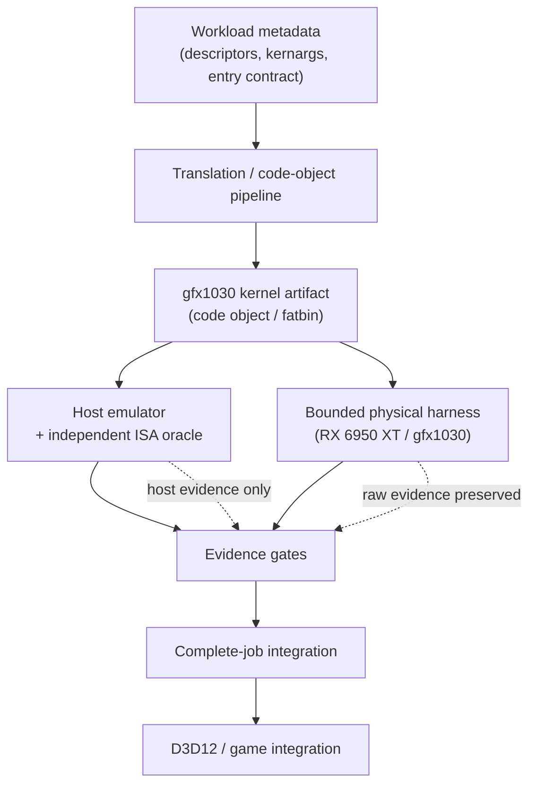

# DLSS Neural Rendering on AMD RDNA2 (gfx1030)

### Experimental Compatibility Research

[](https://github.com/Sakushey/gfx1030-dlss-nr-research/actions/workflows/ci.yml)
[](https://github.com/Sakushey/gfx1030-dlss-nr-research/actions/workflows/publication-audit.yml)
[](LICENSE)

Experimental open-source compatibility research investigating whether
DLSS Neural Rendering workloads can be translated, validated, and
executed on AMD RDNA2 / Navi21-class gfx1030 hardware.

> **Development status: Phase 16BO / A8C11 — standalone canonical launch certified; authentic GTA Story Mode reached; first capture still blocked.**
> The maintainer-local report of record retains the SOURCE_CANONICAL 71/71 host
> and 320×320 / 512×512 gfx1030 device-fixture passes, and now adds a scoped
> standalone launch certificate: two canonical symbols execute through
> `MODULE_RESOLVED_LAUNCH_V1`. GTA V Enhanced also reached authentic Story Mode
> in a true no-background-neural configuration with the isolated capture hook
> operating in-game. The first Story-mode pattern claim then failed at
> post-fence `Map(readback)`, froze presents and entered `ERR_GFX_STATE`;
> §23 cancelled the GTA master. **No GTA frame was captured, CaptureArm never
> armed, and no presented/temporal/performance claim is made.** Active P0: #82.

---

## What this project is

There is a large body of public work on translating NVIDIA-oriented GPU
workloads to other architectures, but very little of it publishes a
*proof trail*: a record of which claims were established at which level,
with the negative controls that make those claims meaningful.

This project is an attempt to do that properly for one narrow,
well-defined case — a DLSS Neural Rendering workload on AMD RDNA2
(gfx1030). The interesting output is not a compatibility layer; it is a
methodology and a set of original host-side tools for establishing what
is actually true at each step.

Concretely, the repository contains original work in four areas:

- **A host instruction emulator** for the gfx1030/gfx1100 wave32 subset
  used by the workload under study, with EXEC/VCC/SCC semantics and
  deterministic cycle detection.
- **An independent scalar ISA oracle**, written separately from the
  emulator, used to cross-check emulated behaviour rather than to
  restate it.
- **HIP interop tooling** — an original ABI-forwarding bridge, a
  fail-closed fatbin identity gate, and a mock backend that lets the
  launch path be exercised with no GPU present.
- **Bounded physical harnesses and host-side analysis utilities** for
  running exactly one small experiment on real hardware and preserving
  the raw evidence.

## What this project is not

- It is **not** a game mod, a crack, or a piracy tool.
- It does **not** redistribute any proprietary asset, game file, NVIDIA
  binary, or AMD runtime DLL. See [THIRD_PARTY_NOTICES.md](THIRD_PARTY_NOTICES.md).
- It does **not** claim that host-validated behaviour implies
  hardware-valid behaviour. Treating those as equivalent is the single
  most common error this project is built to avoid.

---

## Development status

| Area | Current state |
| --- | --- |
| Phase | **16BO / A8C11** |
| native/recovered backend | **NOT_READY**; intentionally not advanced |
| SOURCE_CANONICAL host graph | **Host A 71/71 + Host B 71/71** |
| SOURCE_CANONICAL gate | **ARMED 25/25**, 186 comparisons |
| mutation / independent audit | **27/27 rejected + 27/27 rejected** |
| physical gfx1030 device fixtures | **320 PASS + 512 PASS** |
| standalone canonical launch certificate | **PASS**, 2/33 symbols via `MODULE_RESOLVED_LAUNCH_V1` |
| registered-static canonical path | **FAIL rc=98**, still open (#80) |
| authentic GTA Story Mode | **reached** in true no-background-neural configuration |
| isolated capture hook in-game | **operating**; menu pattern 3079 verified paints |
| active GTA blocker | **Story-mode post-fence `Map(readback)` refusal** (#82) |
| GTA capture / presented neural frame | **none / none** |
| consecutive frames | **0** |
| warm temporal/device sequence | not reached |
| performance | intentionally out of scope |

### The current engineering boundary

A8C11 supersedes A8C10 as the maintainer-local report of record.

The prior SOURCE_CANONICAL proof remains standing: two complete 71-block host
fixtures, an ARMED 25/25 live gate, 27/27 mutation rejection, 27/27 independent
attack rejection, and complete physical gfx1030 device-fixture passes at
320×320 and 512×512.

A8C11 adds a **claim-scoped standalone launch certificate**. The canonical
gfx1030 image loads and resolves through the module API, and two of 33 canonical
symbols dispatch and complete through `MODULE_RESOLVED_LAUNCH_V1`. The original
registered-static canonical lookup path remains a separate failure
(`rc=98 / hipErrorInvalidDeviceFunction`) tracked in
[#80](https://github.com/Sakushey/gfx1030-dlss-nr-research/issues/80).
Do not summarize the certificate as “hipLaunchKernel fixed”.

The GTA boundary also advanced. A true no-background-neural campaign reached
authentic Story Mode for the first time with quarantine intact and only the
isolated capture DLL injected. The capture hook operated in-game; the menu
pattern path produced 3079 verified paints and an exact 784/784/784
present/claim/remain reconciliation.

The first Story-mode pattern claim then failed **after fence completion** at
`Map(readback)`, which triggered the fail-closed refusal, froze presents and
entered `ERR_GFX_STATE`. The specific HRESULT was not captured in this
revision, and the queue-state-desynchronization idea remains an **unmeasured
hypothesis**, not a root-cause claim. Active P0 is now
[#82](https://github.com/Sakushey/gfx1030-dlss-nr-research/issues/82).

Most importantly, **no GTA frame exists yet**. `CaptureArm` was never armed,
Q5 is `NOT_ATTEMPTED_BLOCKED_BY_23`, consecutive frame count is zero, and
pattern paints are not captures.

Physical authorization is closed: Master A is 6/6 exhausted; Master B was
cancelled by §23 after two starts and its remaining two slots are void. No prior
master/start id may be reopened. Any future device/GTA campaign requires a
fresh operator ask and a new master.

Publication still lags the maintained tree. [#70](https://github.com/Sakushey/gfx1030-dlss-nr-research/issues/70)
tracks A8C11 source/integration publication and
[#68](https://github.com/Sakushey/gfx1030-dlss-nr-research/issues/68) tracks the
sanitized evidence bundle. Manifest-tracked historical/current-state surfaces
must be regenerated from canonical provenance rather than hand-edited with
invented hashes.

No performance/async/reuse/zero-copy work belongs on the critical path before
#82 closes and authentic cold GTA frames exist.

See [the historical A8C8 state-repair note](docs/phase16bo-a8c8-state-repair.md).
---

## The proof ladder

Every claim in this project sits on exactly one rung. **Passing one rung
never implies the next.** The distance between "the host model agrees
with itself" and "a frame was presented" is where most compatibility
claims in this space quietly break, so the rungs are named explicitly
and used as required evidence labels on every issue and pull request.

```
 1. Host static correctness
 2. Host dynamic / independent oracle
 3. One-workgroup physical
 4. Multi-workgroup
 5. Authentic full dispatch
 6. Complete neural job
 7. D3D12 / HIP interop
 8. Presented frame
 9. Temporal stability
10. Sustained gameplay
11. Performance
```

Rungs 1–2 need no GPU and anyone can contribute to them. Rungs 3 and
above require gfx1030 hardware and the project's bounded-experiment
discipline — see [docs/hardware-testing-policy.md](docs/hardware-testing-policy.md).

---

## Architecture


```mermaid
flowchart TD
    A["Workload metadata<br/>(descriptors, kernargs, entry contract)"] --> B["Translation / code-object pipeline"]
    B --> C["gfx1030 kernel artifact<br/>(code object / fatbin)"]

    C --> D["Host emulator<br/>+ independent ISA oracle"]
    C --> E["Bounded physical harness<br/>(RX 6950 XT / gfx1030)"]

    D --> F["Evidence gates"]
    E --> F

    F --> G["Complete-job integration"]
    G --> H["D3D12 / game integration"]

    D -.->|"host evidence only"| F
    E -.->|"raw evidence preserved"| F
```

The two branches never substitute for each other. Host evidence is
cheap, fast, and reproducible; physical evidence is authoritative but
scarce and bounded. The evidence gates exist to keep a result from
being promoted above the rung it actually reached.

---

## Where contributors can help

Specialist review is welcome **even if you do not have the target GPU** —
most of the ladder is host-side and is where the project most needs
independent eyes.

| Area | Why it matters here |
| --- | --- |
| RDNA2 / GFX10 ISA | validating instruction-form coverage and control-operand selection |
| AMDGPU backend / code object expertise | correctness of the produced gfx1030 code objects beyond ABI shape |
| D3D12 capture / queue ownership | **P0:** Story-mode readback, queue/backbuffer generation, fences, real HRESULT/device-removal diagnostics (#82) |
| ROCm / HIP runtime | registered-static rc=98 remains a secondary fail-closed defect (#80); module-resolved standalone dispatch is certified |
| EXEC / VCC / wave32 behaviour | the emulator's hardest correctness surface |
| GPU synchronization / waitcnt | the leading hypothesis space for the liveness failure |
| Compiler / binary translation | independent review of translated instruction forms |
| Warm temporal/history correctness | gated behind two correctly paired/presented cold GTA SOURCE_CANONICAL frames (#66) |
| Independent RDNA2 reproduction | reproduce the qualified source/core path on another target device without transferring binaries |
| D3D12 / HIP interoperability | qualify direct/zero-copy transport as an optional engineering optimization |
| Performance engineering | optimize only against a faithful synchronous control with exactness + ABBA-style timing |
| Reproducibility / CI | keeping host-only checks honest and portable |
| Documentation | making the proof model legible to newcomers |

Good first contributions are usually on rungs 1–2: an independent
computation of an expected value, a negative control that *should* fail
and does, or a documented disagreement between the emulator and the
oracle.

Start with the live tracker: [Story-mode capture blocker #82](https://github.com/Sakushey/gfx1030-dlss-nr-research/issues/82),
[registered-static rc=98 #80](https://github.com/Sakushey/gfx1030-dlss-nr-research/issues/80),
[A8C11 publication #70](https://github.com/Sakushey/gfx1030-dlss-nr-research/issues/70),
[sanitized A8C11 evidence #68](https://github.com/Sakushey/gfx1030-dlss-nr-research/issues/68),
[temporal qualification #66](https://github.com/Sakushey/gfx1030-dlss-nr-research/issues/66),
[second-gfx1030 reproduction #9](https://github.com/Sakushey/gfx1030-dlss-nr-research/issues/9), and
[post-faithful optimization #58](https://github.com/Sakushey/gfx1030-dlss-nr-research/issues/58).

Read [CONTRIBUTING.md](CONTRIBUTING.md) before opening a pull request.

---

## Evidence labels

Every claim must be classified at the highest level **actually
established**, not the highest level aspired to:

`PROPOSED`, `HOST_STATIC`, `HOST_VALIDATED`, `HOST_INDEPENDENT_ORACLE`,
`PHYSICAL_DIAGNOSTIC`, `PHYSICAL_ONE_WORKGROUP`,
`PHYSICAL_MULTI_WORKGROUP`, `COMPLETE_JOB`, `INTEROP`,
`PRESENTED_FRAME`, `TEMPORAL`, `PERFORMANCE`.

The distinction between `HOST_VALIDATED` and any `PHYSICAL_*` label is
the one that matters most.

---

## Repository layout

```
src/emulator/   host instruction emulator and LDS/DS semantic models
src/oracle/     independent scalar ISA oracle
src/isa/        instruction decode, rebuild, and memory-model gate tooling
src/bridge/     HIP interop bridge, ABI probes, mock backend
src/harness/    bounded physical host harnesses
tools/          host-side analysis utilities
tests/          bounded gfx1030 test program
scripts/        run scripts
docs/           methodology, policy, and provenance documentation
audit/          publication provenance and audit records
```

## Running the tests

The only component that touches a GPU is `tests/soft_wmma_test.cpp`.
Everything else is host-only and needs no hardware.

```powershell
# Host-only checks (no GPU, no GPU driver, stdlib only):
python -m unittest discover -s tests/host -t tests/host

# Publication audit (secrets, personal paths, manifest drift):
python scripts/verify_publication.py

# One bounded RDNA2 experiment (requires ROCm 6.4 + MSVC, no admin).
# The default remains gfx1030; use -Target gfx1031/gfx1032 only on a matching detected device:
powershell -ExecutionPolicy Bypass -File scripts\run_test.ps1 -Target gfx1030
```

See [REPRODUCIBILITY.md](REPRODUCIBILITY.md) for the full setup and
[docs/build-and-setup.md](docs/build-and-setup.md) for toolchain detail.

---

## License

Unless otherwise noted, original project code is licensed under
**Apache-2.0** (see [LICENSE](LICENSE)). Third-party components retain
their respective licenses — see [THIRD_PARTY_NOTICES.md](THIRD_PARTY_NOTICES.md).

## Affiliation

This is an independent, unofficial research project. It is not
affiliated with, endorsed by, or supported by NVIDIA, AMD, Rockstar
Games, Take-Two Interactive, or any third-party mod or project
referenced by the research.

## Documentation

| Document | Purpose |
| --- | --- |
| [STATUS.md](STATUS.md) | authoritative current state |
| [ARCHITECTURE.md](ARCHITECTURE.md) | component design |
| [ROADMAP.md](ROADMAP.md) | milestones M0–M9 |
| [REPRODUCIBILITY.md](REPRODUCIBILITY.md) | how to reproduce results |
| [docs/proof-model.md](docs/proof-model.md) | the evidence ladder in detail |
| [docs/hardware-testing-policy.md](docs/hardware-testing-policy.md) | bounded-experiment rules |
| [docs/reverse-engineering-boundaries.md](docs/reverse-engineering-boundaries.md) | what this project will and will not do |
| [docs/PROVENANCE.md](docs/PROVENANCE.md) | where the published code came from |
| [docs/maintainer-publication-sync.md](docs/maintainer-publication-sync.md) | safe recurring private-to-public sync procedure |
