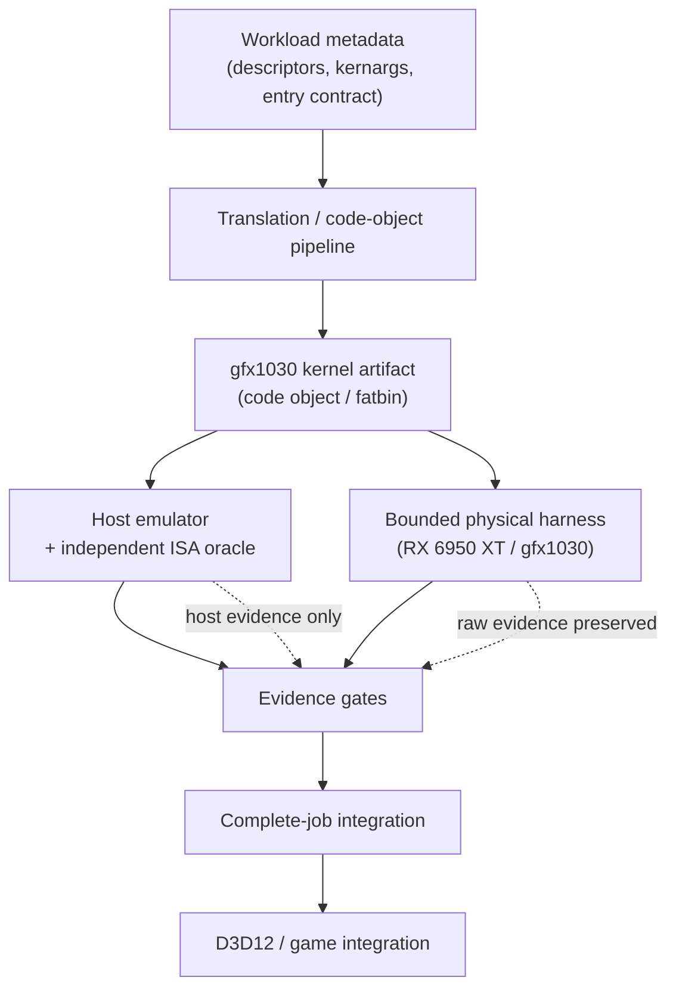

# DLSS Neural Rendering on AMD RDNA2 (gfx1030)

### Experimental Compatibility Research

[](https://github.com/Sakushey/gfx1030-dlss-nr-research/actions/workflows/ci.yml)
[](https://github.com/Sakushey/gfx1030-dlss-nr-research/actions/workflows/publication-audit.yml)
[](LICENSE)

Experimental open-source compatibility research investigating whether
DLSS Neural Rendering workloads can be translated, validated, and
executed on AMD RDNA2 / Navi21-class gfx1030 hardware.

> **Development status: Phase 16BO / A8C8 — public-state reconciliation in progress.**
> The latest maintainer report of record does **not** support the earlier public
> A8C6 first-frame claims. The native/recovered path remains incomplete; no
> project-owned gfx1030 neural frame or GTA capture/presentation is currently
> established by the authoritative local evidence. The immediate engineering
> path is a separate, explicitly labeled source-canonical backend tracked in #76.

---

## What this project is

There is a large body of public work on translating NVIDIA-oriented GPU
workloads to other architectures, but very little of it publishes a
*proof trail*: a record of which claims were established at which level,
with the negative controls that make those claims meaningful.

This project is an attempt to do that properly for one narrow,
well-defined case — a DLSS Neural Rendering workload on AMD RDNA2
(gfx1030). The interesting output is not a compatibility layer; it is a
methodology and a set of original host-side tools for establishing what
is actually true at each step.

Concretely, the repository contains original work in four areas:

- **A host instruction emulator** for the gfx1030/gfx1100 wave32 subset
  used by the workload under study, with EXEC/VCC/SCC semantics and
  deterministic cycle detection.
- **An independent scalar ISA oracle**, written separately from the
  emulator, used to cross-check emulated behaviour rather than to
  restate it.
- **HIP interop tooling** — an original ABI-forwarding bridge, a
  fail-closed fatbin identity gate, and a mock backend that lets the
  launch path be exercised with no GPU present.
- **Bounded physical harnesses and host-side analysis utilities** for
  running exactly one small experiment on real hardware and preserving
  the raw evidence.

## What this project is not

- It is **not** a game mod, a crack, or a piracy tool.
- It does **not** redistribute any proprietary asset, game file, NVIDIA
  binary, or AMD runtime DLL. See [THIRD_PARTY_NOTICES.md](THIRD_PARTY_NOTICES.md).
- It does **not** claim that host-validated behaviour implies
  hardware-valid behaviour. Treating those as equivalent is the single
  most common error this project is built to avoid.

---

## Development status

| Area | Current state |
| --- | --- |
| Phase | **16BO / A8C8** |
| native/recovered host graph | traversable but incomplete |
| native core-required execution | **89/94 placeholder nodes remain across 25 families** |
| native REAL certification | **4/30 families** in the latest report of record |
| temporal host contract | implemented and host-tested |
| project-owned gfx1030 neural frame | **not established** |
| GTA V Enhanced capture | **not established** |
| presented GTA neural frame | **not established** |
| warm temporal/device sequence | not reached |
| sustained gameplay | not reached |
| performance | intentionally out of scope |

### The current engineering boundary

The earlier public A8C6 coordination text overstated the canonical state. A later
local reconciliation found that the public success claims were not backed by the
corresponding local implementation and receipts. The public repository must
therefore treat those physical/game milestones as **not established** until a
new evidenced path proves them.

The historical native/recovered backend remains valuable research, but it must
stay fail-closed where native layout/semantic evidence is absent. It is not a
prerequisite for the practical rendering milestone.

The current P0 path is [SOURCE_CANONICAL_BACKEND #76](https://github.com/Sakushey/gfx1030-dlss-nr-research/issues/76):
a separately labeled project-controlled implementation of the recovered logical
71-block network semantics using authenticated user-owned model weights,
canonical project-owned activation layouts, an independent CPU reference, and
simple correctness-first HIP kernels for gfx1030.

No source-backend success may be reported as native NVIDIA-kernel parity. No
performance/async/reuse/zero-copy work is on the critical path until the
faithful source backend first produces independently checked cold frames.

See [the A8C8 state-repair note](docs/phase16bo-a8c8-state-repair.md).

---

## The proof ladder

Every claim in this project sits on exactly one rung. **Passing one rung
never implies the next.** The distance between "the host model agrees
with itself" and "a frame was presented" is where most compatibility
claims in this space quietly break, so the rungs are named explicitly
and used as required evidence labels on every issue and pull request.

```
 1. Host static correctness
 2. Host dynamic / independent oracle
 3. One-workgroup physical
 4. Multi-workgroup
 5. Authentic full dispatch
 6. Complete neural job
 7. D3D12 / HIP interop
 8. Presented frame
 9. Temporal stability
10. Sustained gameplay
11. Performance
```

Rungs 1–2 need no GPU and anyone can contribute to them. Rungs 3 and
above require gfx1030 hardware and the project's bounded-experiment
discipline — see [docs/hardware-testing-policy.md](docs/hardware-testing-policy.md).

---

## Architecture


```mermaid
flowchart TD
    A["Workload metadata<br/>(descriptors, kernargs, entry contract)"] --> B["Translation / code-object pipeline"]
    B --> C["gfx1030 kernel artifact<br/>(code object / fatbin)"]

    C --> D["Host emulator<br/>+ independent ISA oracle"]
    C --> E["Bounded physical harness<br/>(RX 6950 XT / gfx1030)"]

    D --> F["Evidence gates"]
    E --> F

    F --> G["Complete-job integration"]
    G --> H["D3D12 / game integration"]

    D -.->|"host evidence only"| F
    E -.->|"raw evidence preserved"| F
```

The two branches never substitute for each other. Host evidence is
cheap, fast, and reproducible; physical evidence is authoritative but
scarce and bounded. The evidence gates exist to keep a result from
being promoted above the rung it actually reached.

---

## Where contributors can help

Specialist review is welcome **even if you do not have the target GPU** —
most of the ladder is host-side and is where the project most needs
independent eyes.

| Area | Why it matters here |
| --- | --- |
| RDNA2 / GFX10 ISA | validating instruction-form coverage and control-operand selection |
| AMDGPU backend / code object expertise | correctness of the produced gfx1030 code objects beyond ABI shape |
| ROCm / HIP runtime | interop semantics, error propagation, and post-watchdog behaviour |
| EXEC / VCC / wave32 behaviour | the emulator's hardest correctness surface |
| GPU synchronization / waitcnt | the leading hypothesis space for the liveness failure |
| Compiler / binary translation | independent review of translated instruction forms |
| Warm temporal/history correctness | the next major correctness frontier after the matched cold-frame milestone |
| Independent RDNA2 reproduction | reproduce the qualified source/core path on another target device without transferring binaries |
| D3D12 / HIP interoperability | qualify direct/zero-copy transport as an optional engineering optimization |
| Performance engineering | optimize only against a faithful synchronous control with exactness + ABBA-style timing |
| Reproducibility / CI | keeping host-only checks honest and portable |
| Documentation | making the proof model legible to newcomers |

Good first contributions are usually on rungs 1–2: an independent
computation of an expected value, a negative control that *should* fail
and does, or a documented disagreement between the emulator and the
oracle.

Start with the live tracker: [SOURCE_CANONICAL_BACKEND #76](https://github.com/Sakushey/gfx1030-dlss-nr-research/issues/76),
[state/publication reconciliation #70](https://github.com/Sakushey/gfx1030-dlss-nr-research/issues/70),
[evidence publication #68](https://github.com/Sakushey/gfx1030-dlss-nr-research/issues/68),
[second-gfx1030 reproduction #9](https://github.com/Sakushey/gfx1030-dlss-nr-research/issues/9),
[direct D3D12/HIP interop #7](https://github.com/Sakushey/gfx1030-dlss-nr-research/issues/7), and
[post-faithful optimization #58](https://github.com/Sakushey/gfx1030-dlss-nr-research/issues/58).

Read [CONTRIBUTING.md](CONTRIBUTING.md) before opening a pull request.

---

## Evidence labels

Every claim must be classified at the highest level **actually
established**, not the highest level aspired to:

`PROPOSED`, `HOST_STATIC`, `HOST_VALIDATED`, `HOST_INDEPENDENT_ORACLE`,
`PHYSICAL_DIAGNOSTIC`, `PHYSICAL_ONE_WORKGROUP`,
`PHYSICAL_MULTI_WORKGROUP`, `COMPLETE_JOB`, `INTEROP`,
`PRESENTED_FRAME`, `TEMPORAL`, `PERFORMANCE`.

The distinction between `HOST_VALIDATED` and any `PHYSICAL_*` label is
the one that matters most.

---

## Repository layout

```
src/emulator/   host instruction emulator and LDS/DS semantic models
src/oracle/     independent scalar ISA oracle
src/isa/        instruction decode, rebuild, and memory-model gate tooling
src/bridge/     HIP interop bridge, ABI probes, mock backend
src/harness/    bounded physical host harnesses
tools/          host-side analysis utilities
tests/          bounded gfx1030 test program
scripts/        run scripts
docs/           methodology, policy, and provenance documentation
audit/          publication provenance and audit records
```

## Running the tests

The only component that touches a GPU is `tests/soft_wmma_test.cpp`.
Everything else is host-only and needs no hardware.

```powershell
# Host-only checks (no GPU, no GPU driver, stdlib only):
python -m unittest discover -s tests/host -t tests/host

# Publication audit (secrets, personal paths, manifest drift):
python scripts/verify_publication.py

# One bounded gfx1030 experiment (requires ROCm 6.4 + MSVC, no admin):
powershell -ExecutionPolicy Bypass -File scripts\run_test.ps1
```

See [REPRODUCIBILITY.md](REPRODUCIBILITY.md) for the full setup and
[docs/build-and-setup.md](docs/build-and-setup.md) for toolchain detail.

---

## License

Unless otherwise noted, original project code is licensed under
**Apache-2.0** (see [LICENSE](LICENSE)). Third-party components retain
their respective licenses — see [THIRD_PARTY_NOTICES.md](THIRD_PARTY_NOTICES.md).

## Affiliation

This is an independent, unofficial research project. It is not
affiliated with, endorsed by, or supported by NVIDIA, AMD, Rockstar
Games, Take-Two Interactive, or any third-party mod or project
referenced by the research.

## Documentation

| Document | Purpose |
| --- | --- |
| [STATUS.md](STATUS.md) | authoritative current state |
| [ARCHITECTURE.md](ARCHITECTURE.md) | component design |
| [ROADMAP.md](ROADMAP.md) | milestones M0–M9 |
| [REPRODUCIBILITY.md](REPRODUCIBILITY.md) | how to reproduce results |
| [docs/proof-model.md](docs/proof-model.md) | the evidence ladder in detail |
| [docs/hardware-testing-policy.md](docs/hardware-testing-policy.md) | bounded-experiment rules |
| [docs/reverse-engineering-boundaries.md](docs/reverse-engineering-boundaries.md) | what this project will and will not do |
| [docs/PROVENANCE.md](docs/PROVENANCE.md) | where the published code came from |
| [docs/maintainer-publication-sync.md](docs/maintainer-publication-sync.md) | safe recurring private-to-public sync procedure |
