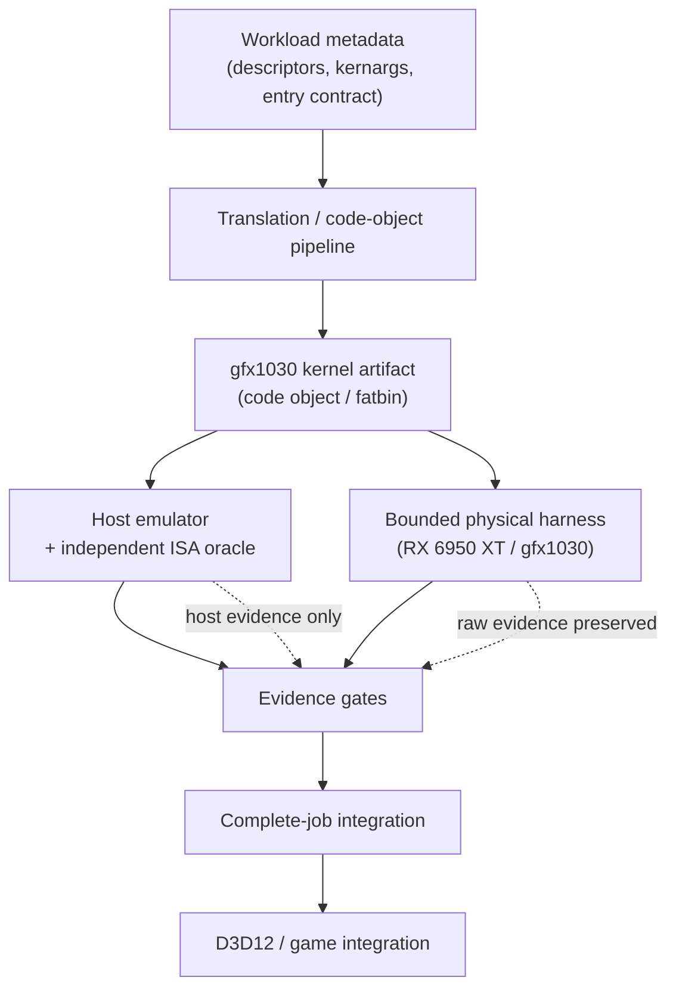

# DLSS Neural Rendering on AMD RDNA2 (gfx1030)

### Experimental Compatibility Research

[](https://github.com/Sakushey/gfx1030-dlss-nr-research/actions/workflows/ci.yml)
[](https://github.com/Sakushey/gfx1030-dlss-nr-research/actions/workflows/publication-audit.yml)
[](LICENSE)

Experimental open-source compatibility research investigating whether
DLSS Neural Rendering workloads can be translated, validated, and
executed on AMD RDNA2 / Navi21-class gfx1030 hardware.

> **Development status: Phase 16BO — A8C14 is the finalized measured report; A8C15 is the active continuation.**
> SOURCE_CANONICAL host/device-fixture proof and the scoped module-resolved gfx1030
> launch certificate remain standing. A later A8C13 campaign established an
> authentic 1920×1080 GTA V Enhanced **source capture**. A8C14 landed the
> prerequisite Frame-C/reproducibility/PresentOwned repairs but earned **no new
> physical rung**: Section 7 is 2/7, freeze V1 is incomplete, and the bounded-f16
> repair is host-proven but still live-untested after attempt 4 was externally reaped.
> **No authentic captured-frame gfx1030 neural device result or NR.png exists yet.**
> Active P0: [#84](https://github.com/Sakushey/gfx1030-dlss-nr-research/issues/84).
>
> A8C15 is an execution directive, not a result: finish Frame-C host truth → complete
> the C freeze → fresh live preflight → conditional captured-frame device execution →
> optional one-shot frozen-frame GTA presentation.

---

## What this project is

There is a large body of public work on translating NVIDIA-oriented GPU
workloads to other architectures, but very little of it publishes a
*proof trail*: a record of which claims were established at which level,
with the negative controls that make those claims meaningful.

This project is an attempt to do that properly for one narrow,
well-defined case — a DLSS Neural Rendering workload on AMD RDNA2
(gfx1030). The interesting output is not a compatibility layer; it is a
methodology and a set of original host-side tools for establishing what
is actually true at each step.

Concretely, the repository contains original work in four areas:

- **A host instruction emulator** for the gfx1030/gfx1100 wave32 subset
  used by the workload under study, with EXEC/VCC/SCC semantics and
  deterministic cycle detection.
- **An independent scalar ISA oracle**, written separately from the
  emulator, used to cross-check emulated behaviour rather than to
  restate it.
- **HIP interop tooling** — an original ABI-forwarding bridge, a
  fail-closed fatbin identity gate, and a mock backend that lets the
  launch path be exercised with no GPU present.
- **Bounded physical harnesses and host-side analysis utilities** for
  running exactly one small experiment on real hardware and preserving
  the raw evidence.

## What this project is not

- It is **not** a game mod, a crack, or a piracy tool.
- It does **not** redistribute any proprietary asset, game file, NVIDIA
  binary, or AMD runtime DLL. See [THIRD_PARTY_NOTICES.md](THIRD_PARTY_NOTICES.md).
- It does **not** claim that host-validated behaviour implies
  hardware-valid behaviour. Treating those as equivalent is the single
  most common error this project is built to avoid.

---

## Development status

| Area | Current state |
| --- | --- |
| Phase | **16BO** |
| measured report of record | **A8C14 finalized** |
| active continuation | **A8C15** — authority/plan, not evidence |
| SOURCE_CANONICAL host graph | **Host A 71/71 + Host B 71/71** |
| SOURCE_CANONICAL gate | **ARMED 25/25**, 186 comparisons |
| mutation / independent audit | **27/27 + 27/27 rejected** |
| physical gfx1030 device fixtures | **320 PASS + 512 PASS** |
| module-resolved launch certificate | **standing PASS at its exact scoped certificate** |
| registered-static path | historical **rc=98**, non-prerequisite (#80 closed) |
| authentic GTA source capture | **PASS** as a standing A8C13 fact |
| A8C14 Frame-C host reference | **INCOMPLETE — Section 7 = 2/7** |
| bounded-f16 repair | host control PASS; **LIVE_UNTESTED** |
| A8C14 freeze | **V1 INCOMPLETE**, not device-runnable |
| real C plan | absent; Class-B recheck correctly fails |
| authentic GTA-derived gfx1030 neural device frame | **NOT YET EARNED** |
| NR.png / visible frozen neural presentation | **none / none** |
| warm temporal / performance | not reached / not qualified |

### Current engineering boundary

The immediate blocker is **host-oracle completion**, not GTA source capture and not
registered-static HIP lookup. A8C14 ran the genuine C host reference four times:
two runs hit the same Windows atomic-rename/share failure (the second at 96.85% of
2,211,840 rows), attempt 3 exposed an eager f16 materialization and that defect was
repaired/proven host-side, and attempt 4 was externally reaped before the repaired
path was reached. The repair is therefore live-untested rather than failed.

The active dependency graph is [#84](https://github.com/Sakushey/gfx1030-dlss-nr-research/issues/84):

~~~text
durable attempt 5
→ Frame-C host truth
→ genuine full-A + expected-C
→ real C plan
→ Class-B + structural falsifiers
→ final host battery
→ complete A8C15 freeze
→ fresh live device preflight
→ authentic captured GTA Frame-C device execution
→ preserve NR.png
→ optional one-shot frozen-frame presentation
~~~

A8C15 points to the existing Master D budget (**4 maximum, 0 used, 4 remaining**),
but this does not authorize an immediate GPU start. Device execution remains gated
by the complete freeze + fresh live preflight, and unchanged retries are forbidden.

### Public documentation warning

The public tree is mid-reconciliation. README and STATUS are the narrow live
coordination surfaces. Several **manifest-tracked** pages still contain the
superseded A8C6 “matched GTA neural frames” story that the A8C8 reconciliation
already withdrew.

Until [#70](https://github.com/Sakushey/gfx1030-dlss-nr-research/issues/70)
regenerates them from canonical provenance, do **not** use ROADMAP.md,
docs/current-state.md, docs/project-overview.md, docs/contribution-areas.md,
docs/hardware-testing-policy.md, the affected glossary/evidence pages, CHANGELOG.md
or CITATION.cff as current proof.

The historical docs/phase16bo-a8c6-state.md stays preserved as a superseded snapshot.

### Current claim ceiling

Standing: SOURCE_CANONICAL host/reference closure at its measured scope, 320/512
gfx1030 device fixtures, the scoped module-resolved launch certificate, and an
authentic 1920×1080 GTA **source capture**.

Not yet established: an authentic GTA-derived gfx1030 neural device result, NR.png
from that result, visible frozen neural presentation, realtime/per-frame NR,
consecutive/temporal correctness, shipping integration or performance/playability.

## The proof ladder

Every claim in this project sits on exactly one rung. **Passing one rung
never implies the next.** The distance between "the host model agrees
with itself" and "a frame was presented" is where most compatibility
claims in this space quietly break, so the rungs are named explicitly
and used as required evidence labels on every issue and pull request.

```
 1. Host static correctness
 2. Host dynamic / independent oracle
 3. One-workgroup physical
 4. Multi-workgroup
 5. Authentic full dispatch
 6. Complete neural job
 7. D3D12 / HIP interop
 8. Presented frame
 9. Temporal stability
10. Sustained gameplay
11. Performance
```

Rungs 1–2 need no GPU and anyone can contribute to them. Rungs 3 and
above require gfx1030 hardware and the project's bounded-experiment
discipline — see [docs/hardware-testing-policy.md](docs/hardware-testing-policy.md).

---

## Architecture


```mermaid
flowchart TD
    A["Workload metadata<br/>(descriptors, kernargs, entry contract)"] --> B["Translation / code-object pipeline"]
    B --> C["gfx1030 kernel artifact<br/>(code object / fatbin)"]

    C --> D["Host emulator<br/>+ independent ISA oracle"]
    C --> E["Bounded physical harness<br/>(RX 6950 XT / gfx1030)"]

    D --> F["Evidence gates"]
    E --> F

    F --> G["Complete-job integration"]
    G --> H["D3D12 / game integration"]

    D -.->|"host evidence only"| F
    E -.->|"raw evidence preserved"| F
```

The two branches never substitute for each other. Host evidence is
cheap, fast, and reproducible; physical evidence is authoritative but
scarce and bounded. The evidence gates exist to keep a result from
being promoted above the rung it actually reached.

---

## Where contributors can help

The live first-frame work is intentionally narrow. Start with
[#84](https://github.com/Sakushey/gfx1030-dlss-nr-research/issues/84).

High-value parallel lanes that do **not** redefine that dependency chain:

- independent same-target / whole-job falsification: #29, #57;
- second-device / gfx1031 / gfx1032 portability: #9, #26, #28, after a current published source identity;
- Windows HIP compiler reproducibility: #41;
- fork-friendly CI / provenance: #27;
- merge-author privacy and owner-review governance: #42, #79;
- temporal/history host contract: #66; physical warm work remains downstream;
- direct D3D12/HIP interop: #7, optional/post-first-frame;
- async allocator qualification: #43; hipMallocAsync remains prohibited for the active path;
- post-faithful optimization: #44, #49, #58, #74, #75.

Publication is tracked by
[#70](https://github.com/Sakushey/gfx1030-dlss-nr-research/issues/70) and
[#68](https://github.com/Sakushey/gfx1030-dlss-nr-research/issues/68).

Historical A8C11 Story readback (#82) and registered-static rc=98 (#80) are closed
as superseded/non-prerequisite tracks; their evidence remains preserved.

## Evidence labels

Every claim must be classified at the highest level **actually
established**, not the highest level aspired to:

`PROPOSED`, `HOST_STATIC`, `HOST_VALIDATED`, `HOST_INDEPENDENT_ORACLE`,
`PHYSICAL_DIAGNOSTIC`, `PHYSICAL_ONE_WORKGROUP`,
`PHYSICAL_MULTI_WORKGROUP`, `COMPLETE_JOB`, `INTEROP`,
`PRESENTED_FRAME`, `TEMPORAL`, `PERFORMANCE`.

The distinction between `HOST_VALIDATED` and any `PHYSICAL_*` label is
the one that matters most.

---

## Repository layout

```
src/emulator/   host instruction emulator and LDS/DS semantic models
src/oracle/     independent scalar ISA oracle
src/isa/        instruction decode, rebuild, and memory-model gate tooling
src/bridge/     HIP interop bridge, ABI probes, mock backend
src/harness/    bounded physical host harnesses
tools/          host-side analysis utilities
tests/          bounded gfx1030 test program
scripts/        run scripts
docs/           methodology, policy, and provenance documentation
audit/          publication provenance and audit records
```

## Running the tests

The only component that touches a GPU is `tests/soft_wmma_test.cpp`.
Everything else is host-only and needs no hardware.

```powershell
# Host-only checks (no GPU, no GPU driver, stdlib only):
python -m unittest discover -s tests/host -t tests/host

# Publication audit (secrets, personal paths, manifest drift):
python scripts/verify_publication.py

# One bounded gfx1030 experiment (requires ROCm 6.4 + MSVC, no admin):
powershell -ExecutionPolicy Bypass -File scripts\run_test.ps1
```

See [REPRODUCIBILITY.md](REPRODUCIBILITY.md) for the full setup and
[docs/build-and-setup.md](docs/build-and-setup.md) for toolchain detail.

---

## License

Unless otherwise noted, original project code is licensed under
**Apache-2.0** (see [LICENSE](LICENSE)). Third-party components retain
their respective licenses — see [THIRD_PARTY_NOTICES.md](THIRD_PARTY_NOTICES.md).

## Affiliation

This is an independent, unofficial research project. It is not
affiliated with, endorsed by, or supported by NVIDIA, AMD, Rockstar
Games, Take-Two Interactive, or any third-party mod or project
referenced by the research.

## Documentation

| Document | Purpose |
| --- | --- |
| [STATUS.md](STATUS.md) | authoritative current state |
| [ARCHITECTURE.md](ARCHITECTURE.md) | component design |
| [ROADMAP.md](ROADMAP.md) | milestones M0–M9 |
| [REPRODUCIBILITY.md](REPRODUCIBILITY.md) | how to reproduce results |
| [docs/proof-model.md](docs/proof-model.md) | the evidence ladder in detail |
| [docs/hardware-testing-policy.md](docs/hardware-testing-policy.md) | bounded-experiment rules |
| [docs/reverse-engineering-boundaries.md](docs/reverse-engineering-boundaries.md) | what this project will and will not do |
| [docs/PROVENANCE.md](docs/PROVENANCE.md) | where the published code came from |
| [docs/maintainer-publication-sync.md](docs/maintainer-publication-sync.md) | safe recurring private-to-public sync procedure |
