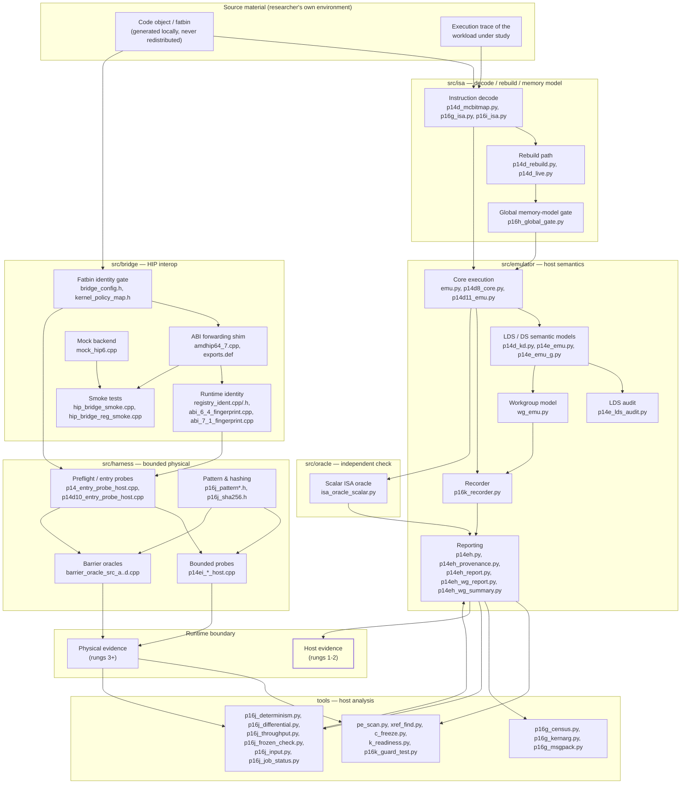

# Architecture

This page describes how the components fit together and, where relevant, **why** they
are built the way they are. The recurring design theme is *separation*: separate
models that can disagree, separate gates that can fail, and a strict boundary between
host evidence and physical evidence.

Scope note: this is the architecture of the research tooling. It is not a claim that
the workload runs correctly anywhere. See [current state](current-state.md).

## Data path

Two properties of this picture matter more than the boxes:

- **The host half and the physical half meet only at the evidence layer.** Host
  artifacts are not inputs to physical qualification; a host result is compared
  against a physical result, never merged with it.
- **The oracle is a sibling of the emulator, not a child of it.** Both consume the
  decoded instruction stream; neither consumes the other's execution.

## The emulator (`src/emulator/`)

The emulator executes the `gfx1030` instruction forms the traced workload actually
uses, on the host CPU, and records what it did per instruction rather than only
producing a final answer.

- **Core execution** (`emu.py`, `p14d8_core.py`, `p14d11_emu.py`) walks the decoded
  stream and maintains architectural state.
- **LDS / DS semantic models** (`p14d_kd.py`, `p14e_emu.py`, `p14e_emu_g.py`) model
  the local data share and the data-share unit explicitly. These are the operations
  most likely to be silently wrong, so they are given their own module rather than
  being folded into the core.
- **LDS audit** (`p14e_lds_audit.py`) cross-checks the LDS model's behavior.
- **Workgroup model** (`wg_emu.py`) adds workgroup-level structure on top of
  single-wave execution.
- **Recorder** (`p16k_recorder.py`) captures the per-instruction record stream. The
  recorder is what makes the emulator *falsifiable*: an aggregate result can match
  for the wrong reasons, but a per-instruction record stream can be compared record
  by record.
- **Reporting** (`p14eh.py` and the `p14eh_*` modules) turns records into
  human-readable and machine-comparable reports.

Design intent: a recorded run should be *inspectable* and *comparable*. If two runs
of the same input disagree at the record level, that is a finding; if they agree only
in aggregate, that is not yet a finding.

## The independent oracle (`src/oracle/`)

`isa_oracle_scalar.py` is a scalar reference implementation of the same ISA semantics.

**Why it must be independent.** An oracle exists to catch mistakes in the emulator.
If the oracle shares code, control flow, or a decode with the emulator, then any
mistake they share is invisible to the comparison — the check degenerates into
"does the emulator agree with itself", which is always yes, and validates nothing.
The value of the oracle comes entirely from the places where it was written
*differently*: different structure, different expression of the semantics, different
handling of edge cases. Those differences are where a disagreement can surface.

Practical consequences of that requirement:

- The oracle does not import the emulator's core execution path.
- The oracle is developed against the ISA description and the decode, not by
  transcribing emulator code.
- A disagreement between the two is investigated on its merits. Neither side is
  assumed correct; in the past, a disagreement has been traced to the *reference
  model* rather than to the emulator, which is exactly the outcome the separation
  is designed to make possible.

`emulator_base__emu.py` in the same directory is the host-side base that the two are
deliberately kept apart from for this reason.

## The ISA decode / rebuild path (`src/isa/`)

This path turns code-object bytes into a decoded instruction stream, and supports
rebuilding.

- **Decode** (`p14d_mcbitmap.py`, `p16g_isa.py`, `p16i_isa.py`) extracts instruction
  forms. Bitmap and census utilities exist because "which forms are present" and
  "which forms are understood" are different questions that must be answered
  separately.
- **Rebuild** (`p14d_rebuild.py`, `p14d_live.py`) reconstructs a working artifact
  from the decoded form, with `p14d_live.py` covering the live/liveness-relevant
  aspects of the reconstruction.
- **Global gate** (`p16h_global_gate.py`) applies the memory-model constraints as a
  gate rather than as an advisory check: an artifact that does not satisfy them is
  rejected rather than annotated.

The decode/rebuild path is the shared upstream of both the emulator and the oracle.
That shared dependency is intentional and acceptable: the thing that must be
independent is the *execution semantics*, not the instruction encoding.

## The HIP bridge (`src/bridge/`)

The bridge studies the HIP runtime boundary without changing the runtime.

### ABI forwarding

`amdhip64_7.cpp` (with `exports.def` controlling exported symbols) forwards the
runtime entry points the research needs to observe, so that calls can be seen and
characterized rather than being opaque. Forwarding is observation; it is not a
modification of the runtime's behavior.

### Runtime identity and fingerprinting

Two runtime generations are fingerprinted separately: `abi_6_4_fingerprint.cpp` and
`abi_7_1_fingerprint.cpp`, with `registry_ident.cpp`/`.h` establishing which runtime
identity is actually in play.

This split is not academic. The physical path targets **AMD ROCm 6.4** on Windows,
because that is the runtime generation that enumerates `gfx1030` in this
environment; ROCm 7.1 does not enumerate this device here. Any result attributed to
"the runtime" is meaningless without saying which runtime identity was loaded. The
fingerprint tooling exists so that the identity is a recorded fact rather than an
assumption.

### The fatbin identity gate

`bridge_config.h` and `kernel_policy_map.h` define a gate over the fatbin/code-object
identity: an artifact is matched against the identity the bridge expects before it is
allowed through. This is a **fail-closed** gate — an artifact whose identity does not
match, or cannot be established, is refused. The alternative (proceed and see) turns
an identity mismatch into a confusing downstream symptom, which is exactly the class
of bug this gate is meant to prevent.

### Fail-closed backend load

The bridge loads its backend **fail-closed**: if the backend cannot be loaded, cannot
be identified, or does not meet its expected preconditions, the load fails and the
caller stops. A partially initialized bridge is never presented as a working one.

### The mock backend

`mock_hip6.cpp` provides a backend that satisfies the bridge's interface without
touching a GPU. It exists so that bridge logic, identity handling, and gate behavior
can be exercised host-side, safely, and repeatedly — and so that a bridge bug is
found on the host rather than during a scarce bounded physical experiment.
`hip_bridge_smoke.cpp` and `hip_bridge_reg_smoke.cpp` are the smoke tests over these
paths.

## The harnesses (`src/harness/`)

Harnesses are deliberately small, bounded host programs that carry a single
parameterized case to a boundary and stop.

- **Entry probes** (`p14_entry_probe_host.cpp`, `p14_entry_probe2_host.cpp`,
  `p14_module_probe_host.cpp`, `p14d10_entry_probe_host.cpp`) characterize the entry
  contract: what the runtime expects to be presented, and what it reports back.
- **The `p14ei_*` family** (`p14ei_a_host.cpp`, `p14ei_b_host.cpp`,
  `p14ei_c0_host.cpp`, `p14ei_c1_host.cpp`, `p14ei_c2_host.cpp`,
  `p14ei_enum_host.cpp`, with `p14ei_c2_isa_check.cc`) are the bounded probes, built
  by `p14ei_build.ps1`. `p14ei_enum_host.cpp` enumerates; the lettered variants are
  the individual bounded cases.
- **Barrier oracles** (`barrier_oracle_src_a.cpp` through `..._d.cpp`) are four
  independent sources used to test barrier hypotheses against each other.
- **Pattern and hashing** (`p16j_pattern.h`, `p16j_pattern_dump.cpp`,
  `p16j_sha256.h`) provide deterministic input patterns and a content hash so that a
  result can be checked by a property predicted in advance rather than by eyeballing
  it.
- **Hidden/private probes** (`probe_hidden.cpp`, `probe_priv.cpp`, `ref_probe.cpp`)
  cover the access shapes the other probes do not.

Harnesses are built by the accompanying `*.ps1` scripts (`p14_build_host.ps1`,
`p14d10_build_host.ps1`, `p14d11_build_host.ps1`, `p14e_build_host.ps1`,
`p14ei_build.ps1`, `p16f_build_host.ps1`). Harnesses that embed a code object need
that artifact generated locally by the researcher; the repository does not ship it.

## The evidence gates (`tools/`)

The utilities in `tools/` are the enforcement layer. They are where "we think this is
right" becomes "this was checked, and here is the check".

- **Determinism and differential checks** (`p16j_determinism.py`,
  `p16j_differential.py`) compare runs and compare models. The differential tool is
  the mechanism by which an emulator result is compared with an oracle result *per
  record*, not per total.
- **Frozen-artifact checks** (`p16j_frozen_check.py`, `c_freeze.py`) detect whether a
  frozen input or output artifact has been altered since it was frozen. A frozen
  artifact that silently changes invalidates every result derived from it.
- **Guard testing** (`p16k_guard_test.py`) tests the guards themselves. A guard that
  cannot fail is not a guard; this tool exists to keep the guards honest by driving
  them against inputs they must reject.
- **Readiness and preflight** (`k_readiness.py`) answers "is this environment in the
  state a physical experiment requires" before anything physical happens.
- **Population and census** (`p16g_census.py`, `p16g_kernarg.py`, `p16g_msgpack.py`)
  characterize what is present: instruction forms, kernarg layouts, and container
  contents.
- **Static inspection** (`pe_scan.py`, `xref_find.py`) read the artifacts without
  executing them.
- **Job bookkeeping** (`p16j_input.py`, `p16j_job_status.py`, `p16j_throughput.py`)
  record what was run and how fast, so that a claim about a run can be traced back to
  it.

The design principle across all of these: **a gate must be able to fail, and must be
shown to pass a case known to be good.** A check that never fails and a check that
never passes are both uninformative. See
[evidence and reproducibility](evidence-and-reproducibility.md).

## Why this decomposition

Each seam in the diagram is a place where two things that could be confused are kept
apart:

| Seam | What it prevents |
| --- | --- |
| Emulator vs. oracle | A shared mistake reading as agreement |
| Decode vs. execution | An encoding bug and a semantics bug looking the same |
| Host evidence vs. physical evidence | Host results silently qualifying hardware |
| Bridge identity gates (fail-closed) | An identity mismatch surfacing as a downstream mystery |
| Mock backend vs. real backend | Bridge bugs consuming scarce physical runs |
| Frozen artifacts vs. working artifacts | Silent drift invalidating derived results |
| Aggregate vs. per-record comparison | Matching totals hiding differing values |

The remainder of the tooling exists to make those seams observable rather than to add
features.
